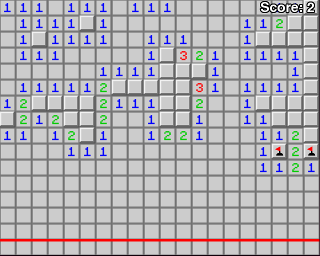

# Infinisweeper

An infinite-scrolling game of Minesweeper.

Written (mostly) at the London Python Dojo.

# Instructions

Left-click to reveal. Right-click to flag a bomb.

Bombs must be flagged before they pass the red line or it is game over! If any
incorrect flags pass the red line it is also game over!

Good luck!

# Installation

    pip install -r requirements.txt

# Running

    pgzrun game.py
